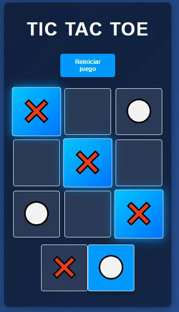

## 🎮 Tic Tac Toe (Tres en Raya)

https://tic-tac-toe-swart-mu-97.vercel.app/




## ✨ Descripción
Juego clásico de Tres en Raya desarrollado con **React** por **Álvaro Macías Tirado** como proyecto. Incluye persistencia de partidas, animaciones al ganar y diseño responsive.

## 🚀 Características destacadas
- ✅ **Interfaz intuitiva** con iconos de ❌ (X) y ⚪ (O)
- 🏆 **Detección inteligente** de victorias (8 combinaciones posibles)
- 💾 **Auto-guardado** en localStorage (no pierdes la partida al recargar)
- 🎉 **Efectos de confeti** al ganar 
- 📱 **Totalmente responsive** (funciona en móvil, tablet y desktop)
- 🔄 **Botón de reinicio** para empezar nuevas partidas


## 📦 Instalación local
1. Clona el repositorio:
```bash
git clone https://github.com/tu-usuario/tic-tac-toe.git
```
Instala dependencias:
```bash
npm install
```
Inicia la aplicación:
```bash
npm run dev
```

